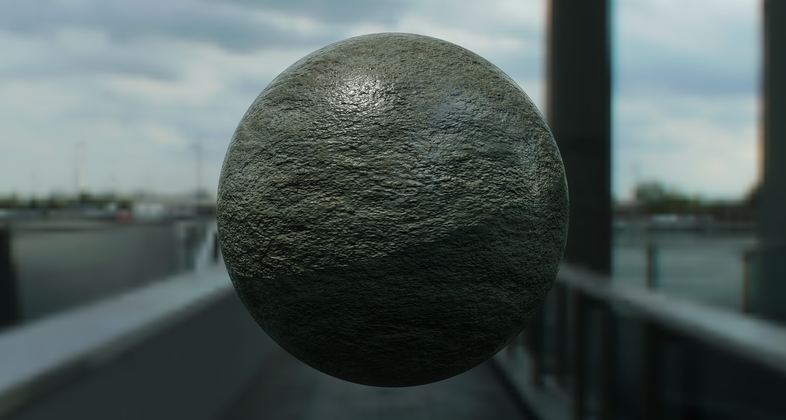

# Neural Material Representation in Falcor

This repository is a master's thesis project exploring neural material representations inside NVIDIA Falcor. It extends Falcor with a pipeline for generating BSDF training data online, training compact neural material models, and rendering the trained representation as a native Falcor material.

<table>
  <tr>
    <td align="center"><strong>Source material</strong></td>
    <td align="center"><strong>Neural material</strong></td>
  </tr>
  <tr>
    <td></td>
    <td></td>
  </tr>
</table>


## Overview

The project focuses on replacing expensive or complex material evaluations with a compact neural representation. A source material is sampled directly on the GPU, the resulting BSDF data is used to train a latent texture and small decoder networks, and the exported assets are loaded back into Falcor for rendering.

```text
Source material
    -> Online GPU BSDF sampling
    -> PyTorch training pipeline
    -> Renderer-ready neural assets
    -> Falcor NeuralMaterial
```

## What This Fork Adds

- A native `NeuralMaterial` implementation integrated with Falcor's material system.
- Runtime loading of neural material assets, including latent textures and decoder weights.
- A BRDF decoder for evaluating the learned material response.
- A learned importance sampler for neural material rendering.
- An `OnlineDataGenerationPass` for generating BSDF samples directly from Falcor materials.
- A PyTorch training pipeline for online data generation, encoder bootstrap, latent texture optimization, decoder training, validation, logging, and asset export.
- A `ThreeLayeredGGXMaterial` source material used for layered-material experiments and material-specific bootstrap features.


## Key Implementation Files

- Neural material runtime:
  [`Source/Falcor/Scene/Material/NeuralMaterial.h`](Source/Falcor/Scene/Material/NeuralMaterial.h),
  [`NeuralMaterial.cpp`](Source/Falcor/Scene/Material/NeuralMaterial.cpp),
  [`NeuralMaterial.slang`](Source/Falcor/Scene/Material/NeuralMaterial.slang)

- Online BSDF data generation:
  [`Source/RenderPasses/OnlineDataGenerationPass`](Source/RenderPasses/OnlineDataGenerationPass)

- Training pipeline:
  [`scripts/data-generation/OnlineStepfreeze.py`](scripts/data-generation/OnlineStepfreeze.py)

- Python wrapper for online data generation:
  [`scripts/data-generation/DataGenerator.py`](scripts/data-generation/DataGenerator.py)

- Renderer asset export:
  [`scripts/data-generation/AssetConverter.py`](scripts/data-generation/AssetConverter.py)

- Training run logging:
  [`scripts/data-generation/training_run_logging.py`](scripts/data-generation/training_run_logging.py)

- Layered source material used for experiments:
  [`Source/Falcor/Scene/Material/ThreeLayeredGGXMaterial.h`](Source/Falcor/Scene/Material/ThreeLayeredGGXMaterial.h),
  [`ThreeLayeredGGXMaterial.cpp`](Source/Falcor/Scene/Material/ThreeLayeredGGXMaterial.cpp),
  [`ThreeLayeredGGXMaterial.slang`](Source/Falcor/Scene/Material/ThreeLayeredGGXMaterial.slang)

- Material-specific bootstrap features:
  [`Source/Falcor/Scene/Material/BootstrapFeatureMaterial.slang`](Source/Falcor/Scene/Material/BootstrapFeatureMaterial.slang)

- SceneBuilder integration:
  [`Source/Falcor/Scene/SceneBuilder.cpp`](Source/Falcor/Scene/SceneBuilder.cpp)

- Neural material preview scene:
  [`MatXScenes/Preview/NeuralSphere_Mosaic.pyscene`](MatXScenes/Preview/NeuralSphere_Mosaic.pyscene)


## Neural Material Assets

A trained neural material is exported as a small asset bundle, currently expected to contain:

- `latent0.exr`
- `latent1.exr`
- `decoder_weights.bin`
- `sampler_weights.bin`
- `metadata.json`
- `sampler_metadata.json`

These assets are loaded by `NeuralMaterial` and evaluated directly in Falcor shaders.

## Current Scope

This is project is developed as part of a master's thesis. The current implementation focuses on neural BSDF approximation, online training data generation, and renderer integration rather than being a general-purpose Falcor extension.

Current assumptions include:

- 8 latent channels stored as two RGBA latent textures.
- Two learned shading frames.
- Runtime-supported MLP widths of 16, 32, or 64.
- Runtime-supported MLP depths of 2 or 3 hidden layers.


---

# Original Falcor README

The following section is the original Falcor README content retained from the upstream repository.


# Falcor

Falcor is a real-time rendering framework supporting DirectX 12 and Vulkan. It aims to improve productivity of research and prototype projects.

Features include:
* Abstracting many common graphics operations, such as shader compilation, model loading, and scene rendering
* Raytracing support
* Python scripting support
* Render graph system to build modular renderers
* Common rendering techniques such post-processing effects
* Unbiased path tracer
* Integration of various RTX SDKs such as DLSS, RTXDI and NRD

## Prerequisites
- Windows 10 version 20H2 (October 2020 Update) or newer, OS build revision .789 or newer
- Visual Studio 2022
- [Windows 10 SDK (10.0.19041.0) for Windows 10, version 2004](https://developer.microsoft.com/en-us/windows/downloads/windows-10-sdk/)
- A GPU which supports DirectX Raytracing, such as the NVIDIA Titan V or GeForce RTX
- NVIDIA driver 466.11 or newer

Optional:
- Windows 10 Graphics Tools. To run DirectX 12 applications with the debug layer enabled, you must install this. There are two ways to install it:
    - Click the Windows button and type `Optional Features`, in the window that opens click `Add a feature` and select `Graphics Tools`.
    - Download an offline package from [here](https://docs.microsoft.com/en-us/windows-hardware/test/hlk/windows-hardware-lab-kit#supplemental-content-for-graphics-media-and-mean-time-between-failures-mtbf-tests). Choose a ZIP file that matches the OS version you are using (not the SDK version used for building Falcor). The ZIP includes a document which explains how to install the graphics tools.
- NVAPI, CUDA, OptiX (see below)

## Building Falcor
Falcor uses the [CMake](https://cmake.org) build system. Additional information on how to use Falcor with CMake is available in the [CMake](docs/development/cmake.md) development documetation page.

### Visual Studio
If you are working with Visual Studio 2022, you can setup a native Visual Studio solution by running `setup_vs2022.bat` after cloning this repository. The solution files are written to `build/windows-vs2022` and the binary output is located in `build/windows-vs2022/bin`.

### Visual Studio Code
If you are working with Visual Studio Code, run `setup.bat` after cloning this repository. This will setup a VS Code workspace in the `.vscode` folder with sensible defaults (only if `.vscode` does not exist yet). When opening the project folder in VS Code, it will prompt to install recommended extensions. We recommend you do, but at least make sure that _CMake Tools_ is installed. To build Falcor, you can select the configure preset by executing the _CMake: Select Configure Preset_ action (Ctrl+Shift+P). Choose the _Windows Ninja/MSVC_ preset. Then simply hit _Build_ (or press F7) to build the project. The binary output is located in `build/windows-ninja-msvc/bin`.

Warning: Do not start VS Code from _Git Bash_, it will modify the `PATH` environment variable to an incompatible format, leading to issues with CMake.

### Linux
Falcor has experimental support for Ubuntu 22.04. To build Falcor on Linux, run `setup.sh` after cloning this repository. You also need to install some system library headers using:

```
sudo apt install xorg-dev libgtk-3-dev
```

You can use the same instructions for building Falcor as described in the _Visual Studio Code_ section above, simply choose the _Linux/GCC_ preset.

### Configure Presets
Falcor uses _CMake Presets_ store in `CMakePresets.json` to provide a set of commonly used build configurations. You can get the full list of available configure presets running `cmake --list-presets`:

```
$ cmake --list-presets
Available configure presets:

  "windows-vs2022"           - Windows VS2022
  "windows-ninja-msvc"       - Windows Ninja/MSVC
  "linux-clang"              - Linux Ninja/Clang
  "linux-gcc"                - Linux Ninja/GCC
```

Use `cmake --preset <preset name>` to generate the build tree for a given preset. The build tree is written to the `build/<preset name>` folder and the binary output files are in `build/<preset name>/bin`.

An existing build tree can be compiled using `cmake --build build/<preset name>`.

## Falcor In Python
For more information on how to use Falcor as a Python module see [Falcor In Python](docs/falcor-in-python.md).

## Microsoft DirectX 12 Agility SDK
Falcor uses the [Microsoft DirectX 12 Agility SDK](https://devblogs.microsoft.com/directx/directx12agility/) to get access to the latest DirectX 12 features. Applications can enable the Agility SDK by putting `FALCOR_EXPORT_D3D12_AGILITY_SDK` in the main `.cpp` file. `Mogwai`, `FalcorTest` and `RenderGraphEditor` have the Agility SDK enabled by default.

## NVAPI
To enable NVAPI support, head over to https://developer.nvidia.com/nvapi and download the latest version of NVAPI (this build is tested against version R535).
Extract the content of the zip file into `external/packman/` and rename `R535-developer` to `nvapi`.

## NSight Aftermath
To enable NSight Aftermath support, head over to https://developer.nvidia.com/nsight-aftermath and download the latest version of Aftermath (this build is tested against version 2023.1).
Extract the content of the zip file into `external/packman/aftermath`.

## CUDA
To enable CUDA support, download and install [CUDA 11.6.2](https://developer.nvidia.com/cuda-11-6-2-download-archive) or later and reconfigure the build.

See the `CudaInterop` sample application located in `Source/Samples/CudaInterop` for an example of how to use CUDA.

## OptiX
If you want to use Falcor's OptiX functionality (specifically the `OptixDenoiser` render pass) download the [OptiX SDK](https://developer.nvidia.com/designworks/optix/download) (Falcor is currently tested against OptiX version 7.3) After running the installer, link or copy the OptiX SDK folder into `external/packman/optix` (i.e., file `external/packman/optix/include/optix.h` should exist).

Note: You also need CUDA installed to compile the `OptixDenoiser` render pass, see above for details.

## NVIDIA RTX SDKs
Falcor ships with the following NVIDIA RTX SDKs:

- DLSS (https://github.com/NVIDIA/DLSS)
- RTXDI (https://github.com/NVIDIAGameWorks/RTXDI)
- NRD (https://github.com/NVIDIAGameWorks/RayTracingDenoiser)

Note that these SDKs are not under the same license as Falcor, see [LICENSE.md](LICENSE.md) for details.

## Resources
- [Falcor](https://github.com/NVIDIAGameWorks/Falcor): Falcor's GitHub page.
- [Documentation](./docs/index.md): Additional information and tutorials.
    - [Getting Started](./docs/getting-started.md)
    - [Render Graph Tutorials](./docs/tutorials/index.md)
- [Rendering Resources](https://benedikt-bitterli.me/resources) A collection of scenes loadable in Falcor (pbrt-v4 format).
- [ORCA](https://developer.nvidia.com/orca): A collection of scenes and assets optimized for Falcor.
- [Slang](https://github.com/shader-slang/slang): Falcor's shading language and compiler.

## Citation
If you use Falcor in a research project leading to a publication, please cite the project.
The BibTex entry is

```bibtex
@Misc{Kallweit22,
   author =      {Simon Kallweit and Petrik Clarberg and Craig Kolb and Tom{'a}{\v s} Davidovi{\v c} and Kai-Hwa Yao and Theresa Foley and Yong He and Lifan Wu and Lucy Chen and Tomas Akenine-M{\"o}ller and Chris Wyman and Cyril Crassin and Nir Benty},
   title =       {The {Falcor} Rendering Framework},
   year =        {2022},
   month =       {8},
   url =         {https://github.com/NVIDIAGameWorks/Falcor},
   note =        {\url{https://github.com/NVIDIAGameWorks/Falcor}}
}
```
